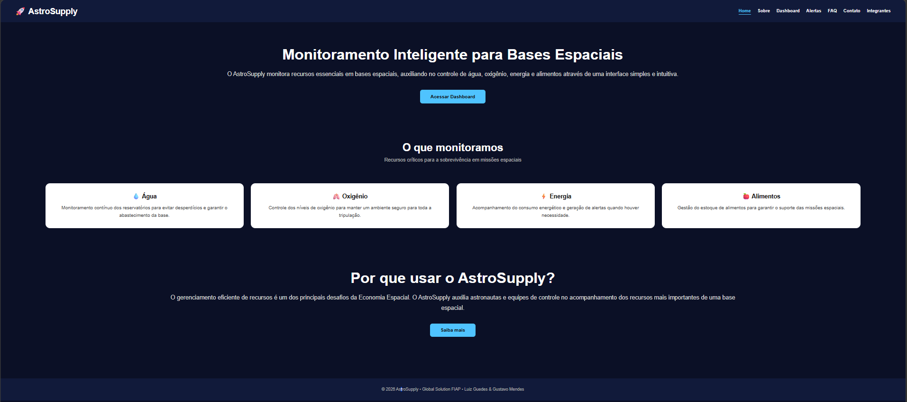
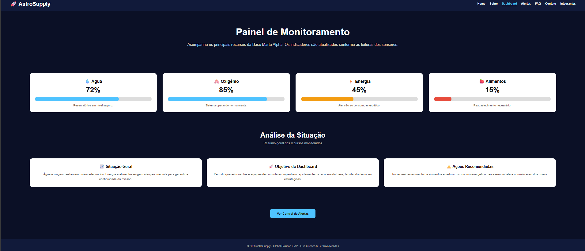
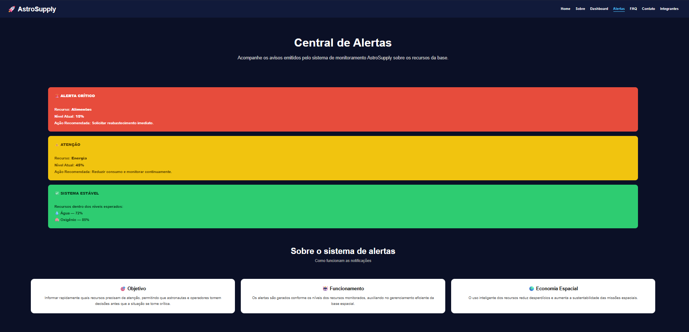

# 🚀 AstroSupply

## 📖 Descrição

O AstroSupply é uma plataforma web para monitoramento inteligente de recursos em bases espaciais. O sistema permite acompanhar indicadores essenciais como água, oxigênio, energia e alimentos, auxiliando na tomada de decisões e na sustentabilidade das operações espaciais.

Projeto desenvolvido para a **Global Solution FIAP 2026**, alinhado ao tema **Economia Espacial**.

---

## 🛠️ Tecnologias Utilizadas

- HTML5
- CSS3
- JavaScript
- Git
- GitHub

---

## 📂 Estrutura de Pastas
AstroSupply/

├── css/

│   └── style.css

├── js/

│   └── script.js

├── assets/

├── index.html

├── sobre.html

├── dashboard.html

├── alertas.html

├── faq.html

├── contato.html

├── integrantes.html

└── README.md

## 🖼️ Imagens do Projeto

---

## ⚙️ Funcionalidades

- Página inicial com apresentação da solução
- Dashboard com monitoramento dos recursos
- Central de Alertas com níveis de criticidade
- Página Sobre com contexto e ODS da ONU
- FAQ com acordeão interativo em JavaScript
- Formulário de contato com validação
- Página de integrantes com links para LinkedIn e GitHub
- Menu hambúrguer responsivo para mobile
- Layout responsivo para mobile, tablet e desktop

---

## 👨‍💻 Autores

### Luiz Gustavo
- RM: 565843
- Turma: 1TDSPX
- [LinkedIn](https://www.linkedin.com/in/luiz-guedes-6303213b9/)
- [GitHub](https://github.com/gustavomrm/CodeStorm-AstroSupply)

### Gustavo Mendes da Rosa Moreira
- RM: 565807
- Turma: 1TDSPX
- [LinkedIn](https://www.linkedin.com/in/gustavo-moreira-7ba9a7354/)
- [GitHub](https://github.com/gustavomrm/CodeStorm-AstroSupply)

---

## 🔗 Repositório GitHub

[https://github.com/gustavomrm/CodeStorm-AstroSupply](https://github.com/gustavomrm/CodeStorm-AstroSupply)

---

## 📧 Contato

Para dúvidas entre em contato pelos LinkedIn dos integrantes acima.

Projeto acadêmico desenvolvido para a FIAP — Global Solution 2026.